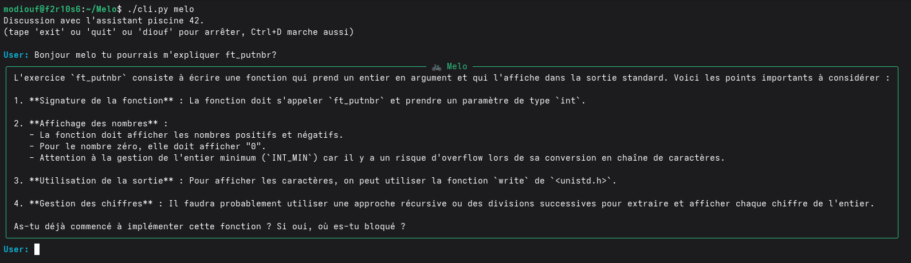
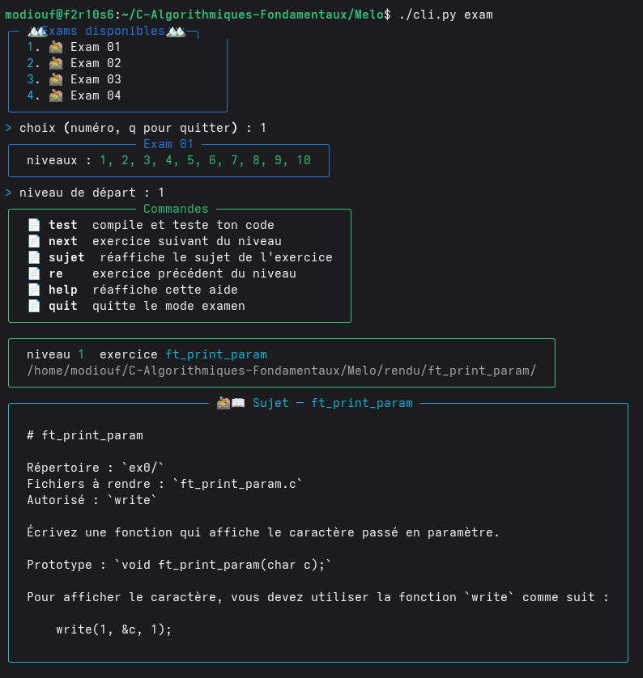
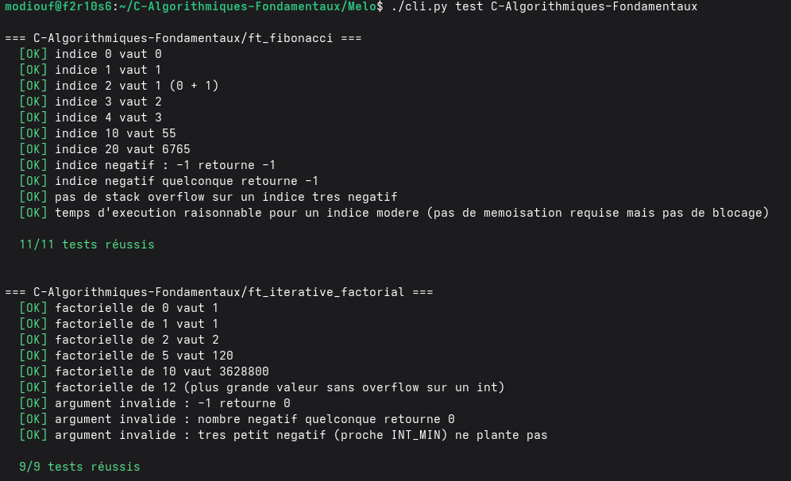

# Simulateur de piscine Melo

Simulateur maison pour la Piscine 42.

`Melo` permet de tester ses exercices avant la Moulinette, de simuler un examen, de vérifier des modules entiers et d'obtenir de l'aide grâce à un assistant IA.

## Features

* 🤖 **Assistant IA** — Melo explique les sujets et répond aux questions sur les exercices.
* 📝 **Exam Simulator** — Simule les conditions d'un examen avec une progression par niveaux.
* 🧪 **Moulinette Simulator** — Permet de tester plusieurs exercices d'un même module.

---

# ⚙️ Installation

Clone le projet puis installe les dépendances :

```bash
git clone <URL_DU_REPO>
cd Melo
pip install -r requirements.txt
```

Pour utiliser l'Assistant IA :

```bash
export OPENAI_API_KEY=sk-...
```


# 🤖 Assistant IA




**Melo** est un chatbot qui fonctionne via des appels API directement depuis le terminal.

Elle n'a **pas accès directement aux fichiers de ton projet**.

À la place, Melo dispose d'un outil appelé `get_exercise_subject`.

Lorsque tu lui demandes d'expliquer un exercice :

1. Melo identifie le nom de l'exercice.
2. Elle appelle `get_exercise_subject`.
3. Le programme recherche le `README.md` correspondant dans `exercises/`.
4. Le contenu du sujet est envoyé à l'IA.
5. Melo lit le sujet et te l'explique avec ses propres mots.
6. Elle ne fournit jamais le code de la solution.

Cela permet à Melo de connaître uniquement le sujet dont tu lui demandes l'explication, plutôt que d'avoir accès directement à tous les fichiers du projet.

### Lancer l'Assistant IA

```bash
./cli.py melo
```

Pour utiliser l'API OpenAI, configure ta clé :

```bash
export OPENAI_API_KEY=sk-...
```


# 📝 Exam Simulator




Le mode `exam` permet de simuler une session d'examen avec une progression par niveaux.

### Lancer un examen

```bash
./cli.py exam
```

Le programme recherche les exercices dans :

```text
exercises_exam/
```

Chaque exercice possède son propre dossier contenant :

```text
exercises_exam/
└── ft_xxx/
    ├── README.md
    └── manifest.yaml
```

### README.md

Le `README.md` contient le **sujet de l'exercice**.

Il est affiché lorsque tu arrives sur l'exercice et sert uniquement à t'expliquer ce que tu dois coder.

Le `README.md` n'est **pas utilisé pour vérifier ton code**.

### manifest.yaml

Le `manifest.yaml` contient les **vrais tests** de l'exercice.

Chaque test :

1. compile ton code avec un petit programme `main`,
2. exécute le programme,
3. récupère sa sortie réelle,
4. compare cette sortie avec `expected_stdout`,
5. vérifie également `expected_exit`.

Exemple de fonctionnement :

```text
Ton code
   ↓
Compilation avec le main du test
   ↓
Exécution
   ↓
stdout / exit code
   ↓
Comparaison avec expected_stdout / expected_exit
   ↓
PASS / FAIL
```

### README vs manifest

Ces deux fichiers ont donc des rôles différents :

```text
README.md
    ↓
Explique quoi coder

manifest.yaml
    ↓
Vérifie si ton code fonctionne correctement
```

Il n'y a **aucune comparaison entre le README et le manifest**.

Le mode exam :

* choisit un exercice par niveau depuis `exams/*.yaml`,
* affiche son `README.md`,
* crée le fichier `.c` dans `rendu/`,
* attend que tu codes,
* puis lance les tests du `manifest.yaml` lorsque tu utilises `test`.


# 🧪 Moulinette Simulator



Le mode `test` permet de vérifier directement ton rendu avec les mêmes principes de tests que le mode exam.

### Lancer un test

```bash
./cli.py test ft_putnbr (pour tester un seul exo)
./cli.py test nom_du_module (pour tester tout le module d'un coup)
```

Le programme recherche l'exercice dans :

```text
exercises/
```

⚠️ Ce dossier est différent de `exercises_exam/`, utilisé par le mode exam.

Il récupère ensuite le `manifest.yaml` de l'exercice.

Pour chaque test, le programme :

1. compile ton code avec le `main` du test,
2. exécute le programme,
3. récupère la sortie réelle,
4. compare avec `expected_stdout`,
5. vérifie `expected_exit`,
6. indique si le test passe ou échoue.
